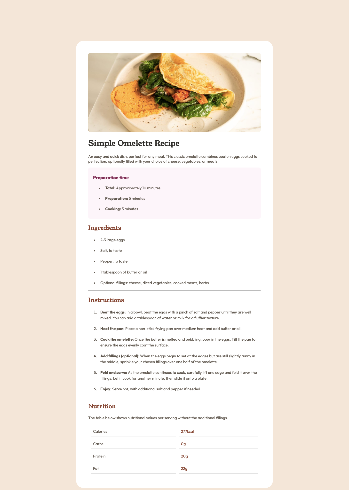

# Frontend - Recipe page 

This is a solution to the [Recipe page challenge on Frontend Mentor](https://www.frontendmentor.io/challenges/recipe-page-KiTsR8QQKm).

### Screenshot




### Links

- Live Site URL: [might not work properly](https://front-end-black-rho.vercel.app/)

## My process

Feel free to use any workflow that you feel comfortable with. Below is a suggested process, but do not feel like you need to follow these steps:
1. Look through the designs to start planning out how you'll tackle the project. This step is crucial to help you think ahead for CSS classes to create reusable styles.
2. Before adding any styles, structure your content with HTML. Writing your HTML first can help focus your attention on creating well-structured content.
3. Write out the base styles for your project, including general content styles, such as `font-family` and `font-size`.
4. Start adding styles to the top of the page and work down. Only move on to the next section once you're happy you've completed the area you're working on.


### Built with

- Semantic HTML5 markup
- CSS custom properties
- Flexbox

### What I learned

Helped me to know to how to apply different fonts

# Getting started
For starting this in your machine, open the terminal and follow these commands:

git clone the repo
```
git clone https://github.com/Vinayy-B/frontEnd.git
```

cd into working directory
```
cd Recipe_page
```

open http://localhost:3000 in browser to run.

